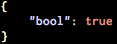

# About

Command line tool to validate and pretty-print JSON syntax of
input files, taking advantage of encoding/json in golang.

# Installation

    go get -u github.com/martinlindhe/validjson

# Usage

Exit code will be 0 if file is good.

    validjson file.json

    OK: file.json

# Pretty-print

    validjson -p file.json

# License

Under [MIT](LICENSE)
